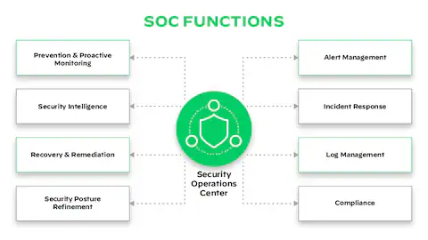
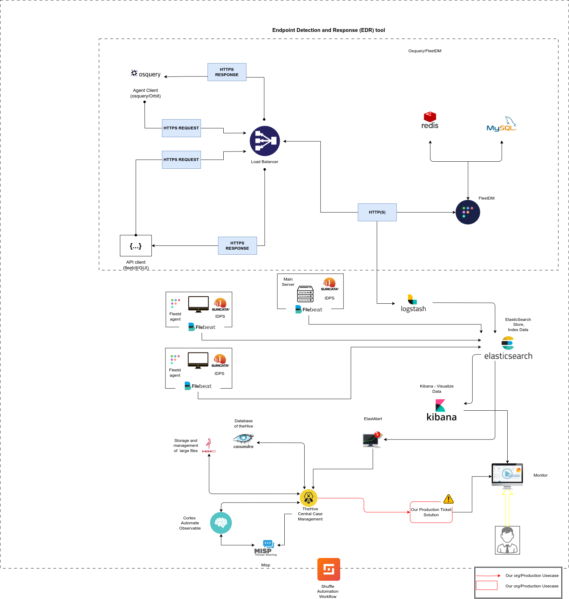

<h1 align="center">Open-Source SOC</h1>

Table of Contents

1. [About](#about)
2. [Project Goal](#project-goal)
3. [Installation](#installation)
4. [What is a SOC?](#what-is-a-soc)
5. [Architecture Diagram](#architecture-diagram)
6. [Contributing](#contributing)

## About

This academic project aims to provide a comprehensive open-source solution for cybersecurity operations, with the objective of making advanced security tools accessible to a wider audience. All components used in this project are open-source and free.
## Project Goal

The main objective of this project is to build a fully functional Security Operations Center (SOC) using open-source tools, all containerized for one-click deployment. Leveraging Docker, the SOC can be seamlessly deployed across diverse environments, ensuring portability and ease of use.

## Installation

To install the SOC follow the Installation Guide [here](https://github.com/DorraJL/Soc-Project/blob/959381070c241f494ccb8680cb04671a364e3f57/SOC%20Implementation%20Guide/README.md)

## What is a SOC?

A Security Operations Center (SOC) is a centralized unit responsible for monitoring, detecting, analyzing, and responding to cybersecurity incidents. It serves as the nerve center for an organization’s cybersecurity, combining people, processes, and technology to protect digital assets. SOC teams use various tools and techniques to continuously monitor networks, systems, and applications, playing a key role in mitigating and resolving security threats.

  

## Architecture Diagram

  

You can find the technology stack [here](./technology_stack.md)

## Contributing

Contributions are welcomed! If you have ideas, improvements, or fixes, feel free to open an issue or submit a pull request.

Thank you for visiting!

